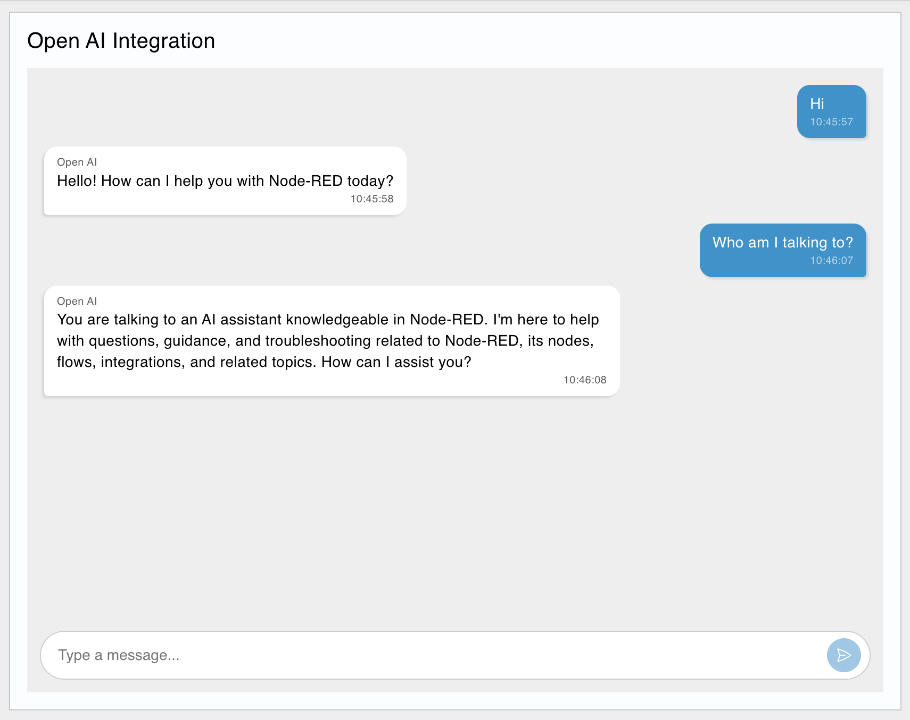
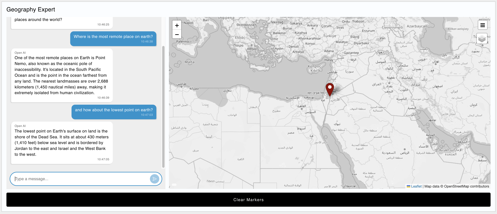

# Chat Window Widget for FlowFuse Dashboard (Node-RED Dashboard 2.0)

This repository contains a third-party, node for the Node-RED Dashboard to provide an interactive chat window widget.

Easily build a chat-based user interface, and seamlessly integrate it with the vast collection of other Node-RED nodes available, including many for well-known AI services and offerings like [OpenAI](https://flows.nodered.org/node/@inductiv/node-red-openai-api) or [ollama](https://flows.nodered.org/node/node-red-contrib-ollama).

Below is a demonstration of the chat widget in action, integrated with an OpenAI node to provide a chatbot interface, one trained on 

## Examples

### OpenAI Chatbot

Here, an OpenAI agent was prompted that it is an expert in Node-RED, and should assist users with flow-building and answering general questions:



### Chat & Worldmap Integration

This agent was provisioned to provide coordinate data alongside it's text-based answers, which are then rendered onto a World Map, also rendered within FlowFuse Dashboard.



## Usage

### Installation

#### Install via Node-RED UI

1. Navigate to a Node-RED Editor
2. Click on the "Manage Palette" option int eh Node-RED menu
3. Switch to the "Install" tab
4. Search for "@flowfuse/node-red-dashboard-2-ui-chat"
5. Click on the "Install" button

#### Install via NPM

```bash
npm install @flowfuse/node-red-dashboard-2-ui-chat
```

### Using in a Flow


Anything sent into the node will be considered as a _received_ message. Any messages typed into the chat will be sent out of the node as a _sent_ message.

#### Predefined Input Types

You can create placeholder items in your chat, like a "Typing" message by using different `msg.topic` values.

##### "Typing" Placeholder

By assigning a `msg.topic` of `_typing`, then a placeholder "Typing..." message will be shown in the chat. This is automatically removed when the next message is received.


##### Defining Message Authors

Any other `msg.topic` values used are assumed to be the name of the "author" of the message.

#### Load Message History

When the chat widget first loads, you can populate it with historical messages by storing them in the widget's datastore. This is useful for:
- Restoring previous conversations when a user returns to the dashboard
- Preloading context or example messages
- Displaying conversation history from a database or file

To load message history, store an array of message objects in the widget's data store. Each message object should have the following properties:

```javascript
{
    "author": "Assistant",      // The name of the message author
    "text": "Hello! How can I help?",  // The message text (supports Markdown)
    "timestamp": 1234567890000, // Unix timestamp in milliseconds
    "sent": false               // true for user messages (right-aligned), false for received (left-aligned)
}
```

**Notes:**
- The `timestamp` field is required for proper message ordering and will be converted to a localized time string for display
- Messages are displayed in the order they appear in the array
- The chat will automatically scroll to the bottom after loading history
- Loading history replaces any existing messages in the chat

## Development

To get started, clone this repository:

```bash
# if using HTTPS:
git clone https://github.com/FlowFuse/node-red-dashboard-2-ui-chat.git

# if using SSH:
git clone git@github.com:FlowFuse/node-red-dashboard-2-ui-chat.git
```

Install dependencies:

```bash
npm install
```

Install the node to your Node-RED instance for development:

```bash
# Change directory to your Node-RED user directory - typically ~/.node-red or c:\Users\<username>\.node-red
cd ~/.node-red
# Install the cloned node package - using the path to where you cloned the repo
npm install /path/to/cloned/repo/node-red-dashboard-2-ui-chat
```

During development, you can use the following command to build the frontend code:

```bash
npm run build:dev
```

For production builds, use:

```bash
npm run build
```

After running a build for front-end changes, you can simply refresh the Node-RED Dashboard to see your changes.

If changes to the Node-RED backend code or the nodes HTML, then you will need to restart Node-RED itself
