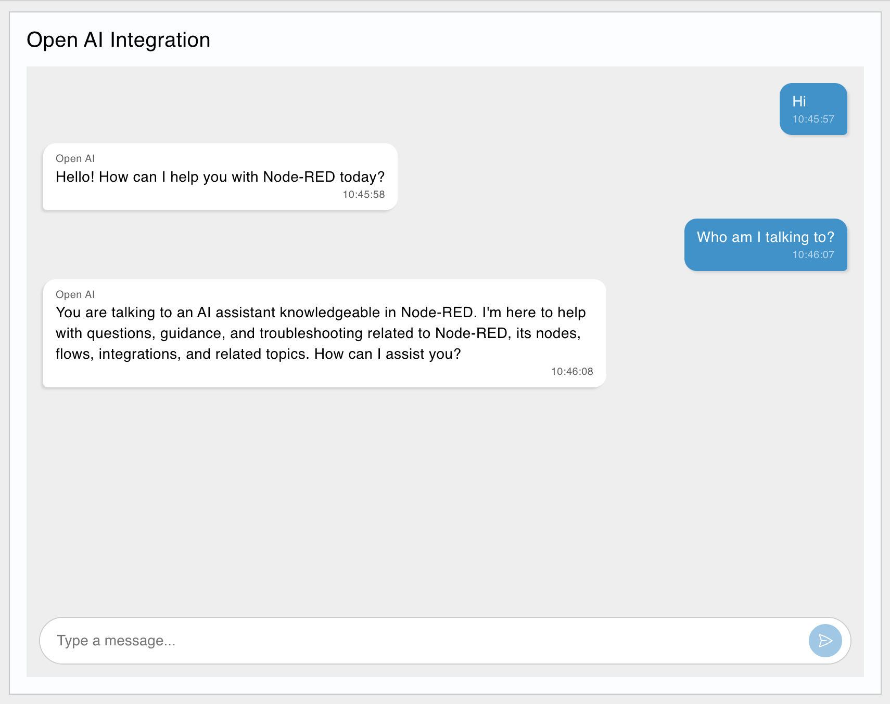
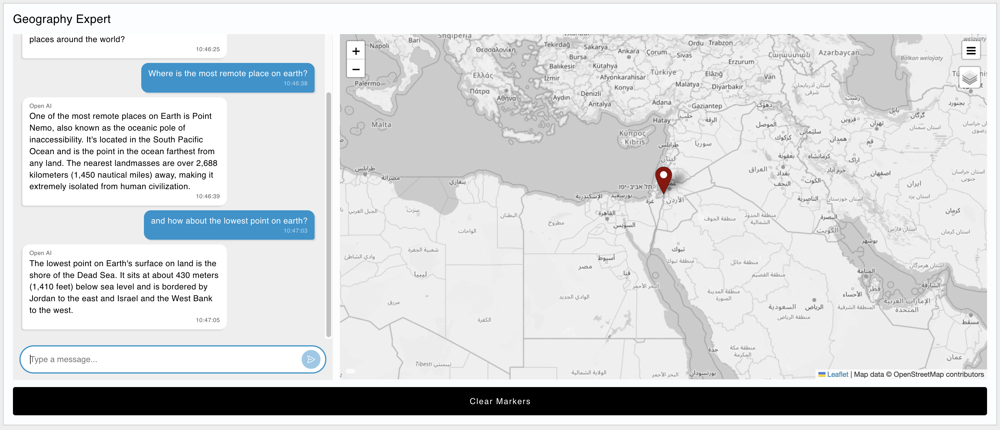

# Chat Window Widget for FlowFuse Dashboard (Node-RED Dashboard 2.0)

This repository contains a third-party, node for the Node-RED Dashboard to provide an interactive chat window widget.

Easily build a chat-based user interface, and seamlessly integrate it with the vast collection of other Node-RED nodes available, including many for well-known AI services and offerings like [OpenAI](https://flows.nodered.org/node/@inductiv/node-red-openai-api) or [ollama](https://flows.nodered.org/node/node-red-contrib-ollama).

Below is a demonstration of the chat widget in action, integrated with an OpenAI node to provide a chatbot interface, one trained on 

## Examples

### OpenAI Chatbot

Here, an OpenAI agent was prompted that it is an expert in Node-RED, and should assist users with flow-building and answering general questions:



### Chat & Worldmap Integration

This agent was provisioned to provide coordinate data alongside it's text-based answers, which are then rendered onto a World Map, also rendered within FlowFuse Dashboard.



## Usage

### Installation

#### Install via Node-RED UI

1. Navigate to a Node-RED Editor
2. Click on the "Manage Palette" option int eh Node-RED menu
3. Switch to the "Install" tab
4. Search for "@flowfuse/node-red-dashboard-2-ui-chat"
5. Click on the "Install" button

#### Install via NPM

```bash
npm install @flowfuse/node-red-dashboard-2-ui-chat
```

### Using in a Flow


Anything sent into the node will be considered as a _received_ message. Any messages typed into the chat will be sent out of the node as a _sent_ message.

#### Predefined Input Types

You can create placeholder items in your chat, like a "Typing" message by using different `msg.topic` values.

##### "Typing" Placeholder

By assigning a `msg.topic` of `_typing`, then a placeholder "Typing..." message will be shown in the chat. This is automatically removed when the next message is received.


##### Defining Message Authors

Any other `msg.topic` values used are assumed to be the name of the "author" of the message.

## Development

To get started, clone this repository:

```bash
# if using HTTPS:
git clone https://github.com/FlowFuse/node-red-dashboard-2-ui-chat.git

# if using SSH:
git clone git@github.com:FlowFuse/node-red-dashboard-2-ui-chat.git
```

Install dependencies:

```bash
npm install
```

Install the node to your Node-RED instance for development:

```bash
# Change directory to your Node-RED user directory - typically ~/.node-red or c:\Users\<username>\.node-red
cd ~/.node-red
# Install the cloned node package - using the path to where you cloned the repo
npm install /path/to/cloned/repo/node-red-dashboard-2-ui-chat
```

During development, you can use the following command to build the frontend code:

```bash
npm run build:dev
```

For production builds, use:

```bash
npm run build
```

After running a build for front-end changes, you can simply refresh the Node-RED Dashboard to see your changes.

If changes to the Node-RED backend code or the nodes HTML, then you will need to restart Node-RED itself

## Release process

In this project, the [Release Please](https://github.com/googleapis/release-please) is used to automatically determine the next release version based on the commit messages in the codebase.

By using the [Conventional Commits](https://www.conventionalcommits.org/en/v1.0.0/), the project adheres to a standardized format for commit messages, which `Release Please` uses to determine whether the next release should be a major, minor, or patch release.

### Components

1. The `Prepare release` GitHub Action workflow:

    * A Release Please action that analyzes commit messages to determine the type of release required (major, minor, patch) based on the Conventional Commits specification
    * Creates a pre-release pull request with the proposed version bump and changelog
    * Once merged, automatically updates the version number in `package.json` and creates a new release on GitHub with the appropriate changelog

2. The `Lint Pull Request Title` GitHub Action workflow:

    * A workflow that runs on pull request creation and uses the `amannn/action-semantic-pull-request` action to validate that pull request titles follow the Conventional Commits format
    * Together with adjusted default merge commit message, this ensures that all commits merged into the main branch adhere to the expected format, allowing Release Please to function correctly

3. The `Publish Release` GitHub Action workflow:

    * A workflow that runs when a new git tag in `v*.*.*` format is pushed, builds the package and publishes the new version to the public npm registry using the `JS-DevTools/npm-publish` action
    * Once package is published, the workflow updates the package version in the Node-RED Flow Library catalogue

### Pull Request Title Format

The Conventional Commits preset expects pull request titles to be in the following format:

```
<type>(<scope>): <subject>
```

* Type: Describes the category of the commit. Examples include:
    * `feat`: A new feature (triggers a minor version bump).
    * `fix`: A bug fix (triggers a patch version bump).
    * `perf`: A code change that improves performance (triggers a patch version bump).
    * `refactor`: A code change that neither fixes a bug nor adds a feature (does not trigger a release unless it's accompanied by a BREAKING CHANGE).
    * `docs`: Documentation-only changes (does not trigger a release).
    * `chore`: Changes to the build process or auxiliary tools and libraries (does not trigger a release).
* Scope: An optional part that provides additional context about what was changed (e.g., module, component).
* Subject: A brief description of the changes.

### Handling Breaking Changes

To indicate a breaking change, the exclamation mark `!` should be used immediately after the type/scope:

* `feat!:`
* `fix!:`
* `refactor!:`
